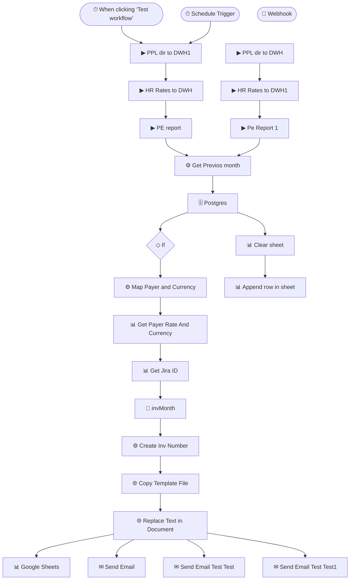

# Automated Contractor Invoicing

> Generates and delivers monthly contractor invoices end-to-end — zero manual work.

**Built with:** n8n, Google Sheets, HTTP/REST, PostgreSQL, Email, JavaScript, Webhooks, Scheduled trigger, Conditional logic, Sub-workflows, Date handling
**Workflow size:** 25 nodes
**Source:** [`workflow.json`](./workflow.json) — the actual n8n workflow (sanitized; see note below)

## Problem
Finance manually created dozens of contractor invoices each month: copying a template, looking up each contractor's rate and currency, numbering the invoice, storing it, and emailing it out. Slow, repetitive, and error-prone.

## Solution
A scheduled n8n workflow that runs at month-end and produces every invoice automatically.

## How it works
1. Triggers on a monthly schedule (with a manual test trigger for ad-hoc runs).
2. Copies an invoice template document and generates a sequential invoice number.
3. Looks up each payer's rate and currency from a Google Sheet and maps them into the document.
4. Fills the template via the Google Docs API (find-and-replace of placeholders).
5. Writes the invoice record to a PostgreSQL data warehouse for reporting.
6. Emails the finalized invoice to the contractor with clear next-step instructions.

## Impact
Removed a recurring monthly manual task and standardized invoice numbering and storage.

## Workflow diagram

---
*`workflow.json` is the real n8n export with its full node graph, expressions, SQL and
JavaScript logic intact. Credentials, endpoints, document IDs, personal data and the
employer's legal-entity details have been removed or replaced with placeholders. See
[SANITIZATION.md](../SANITIZATION.md).*
