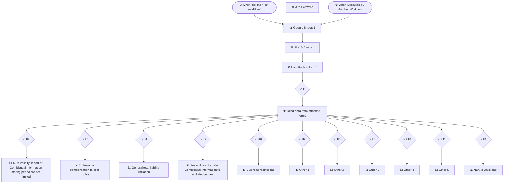

# NDA Import & Risk Classification

> Parses NDA submissions and auto-classifies contract risk for legal review.

**Built with:** n8n, Google Sheets, Jira API, HTTP/REST, Conditional logic
**Workflow size:** 30 nodes
**Source:** [`workflow.json`](./workflow.json) — the actual n8n workflow (sanitized; see note below)

## Problem
Legal received NDAs through a request form and had to read each one and manually tag risk factors (liability caps, validity period, unilateral clauses, transfer to affiliates, etc.) before logging them — tedious and inconsistent.

## Solution
An n8n workflow that ingests NDA form data and classifies terms through a rule-based decision tree.

## How it works
1. Reads structured data from the attached request form via the Jira API.
2. Runs the data through a tree of conditional checks (12+ IF branches) covering each risk factor.
3. Routes each matched risk into the correct category and writes a structured row to Google Sheets.
4. Updates the originating Jira issue so legal sees the classification in context.
5. Designed as a callable sub-workflow so it can be reused by other automations.

## Impact
Turned manual NDA triage into a consistent, auditable, one-pass classification.

## Workflow diagram

---
*`workflow.json` is the real n8n export with its full node graph, expressions, SQL and
JavaScript logic intact. Credentials, endpoints, document IDs, personal data and the
employer's legal-entity details have been removed or replaced with placeholders. See
[SANITIZATION.md](../SANITIZATION.md).*
