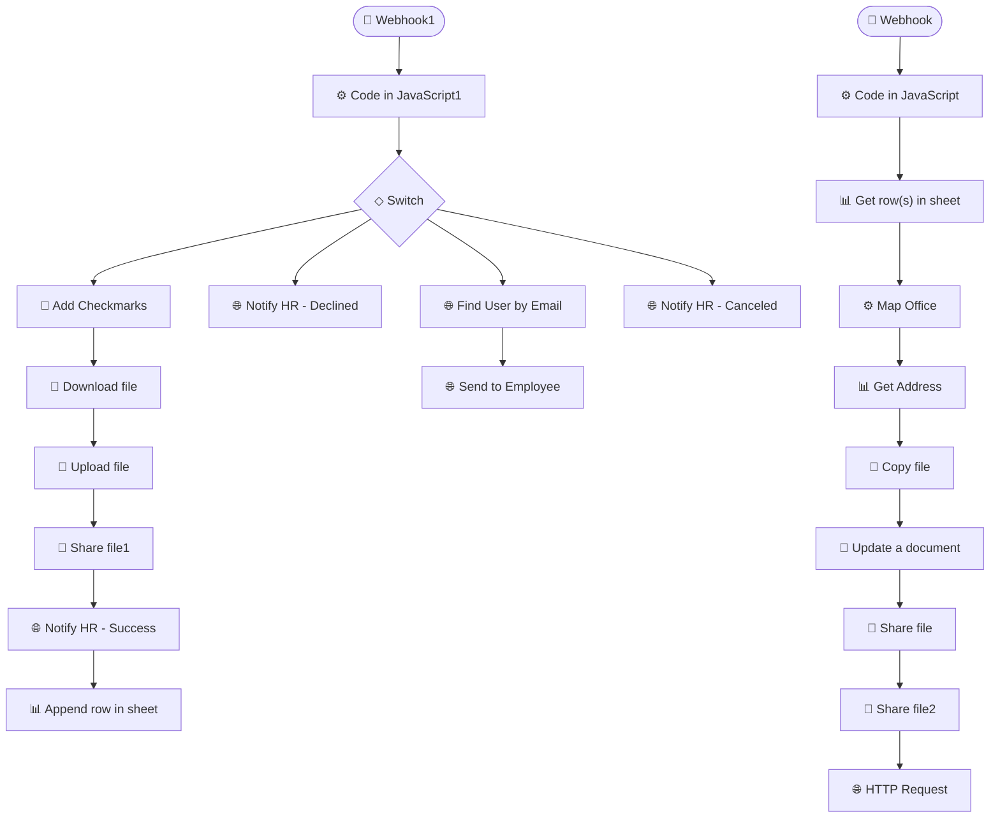

# Employee & Contractor Consent Form Automation

> End-to-end intake, document generation, and HR notification for photo/video consent.

**Built with:** n8n, Google Sheets, Google Docs, Google Drive, HTTP/REST, JavaScript, Webhooks, Conditional routing
**Workflow size:** 23 nodes
**Source:** [`workflow.json`](./workflow.json) — the actual n8n workflow (sanitized; see note below)

## Problem
HR manually generated a personalized consent document for each employee, shared it, chased responses, and tracked outcomes in a spreadsheet by hand.

## Solution
A webhook-driven n8n pipeline that handles the whole consent lifecycle.

## How it works
1. Receives the submission via webhook and branches on the response (accept / decline / cancel).
2. Maps the person's office/location data and generates a personalized document from a template.
3. Uploads and shares the file through the Google Drive API and inserts confirmation marks.
4. Notifies HR of the outcome through status-specific messages (success / declined / canceled).
5. Appends a record to a central Google Sheets registry for tracking.

## Impact
Fully automated a repetitive HR document + tracking process across multiple offices.

## Workflow diagram

---
*`workflow.json` is the real n8n export with its full node graph, expressions, SQL and
JavaScript logic intact. Credentials, endpoints, document IDs, personal data and the
employer's legal-entity details have been removed or replaced with placeholders. See
[SANITIZATION.md](../SANITIZATION.md).*
