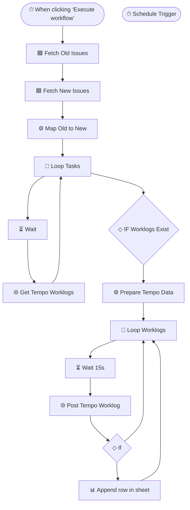

# Jira Migration & Tempo Worklog Transfer

> Migrates issues and their Tempo time logs between Jira projects, safely and at scale.

**Built with:** n8n, Google Sheets, Jira API, HTTP/REST, JavaScript, Scheduled trigger, Batch processing, Rate-limit handling, Conditional logic
**Workflow size:** 15 nodes
**Source:** [`workflow.json`](./workflow.json) — the actual n8n workflow (sanitized; see note below)

## Problem
Moving work between Jira projects meant recreating issues and re-entering time logs by hand — impractical for hundreds of items and prone to hitting API rate limits.

## Solution
An n8n workflow that maps old issues to new ones and transfers their Tempo worklogs.

## How it works
1. Fetches source and destination issues via the Jira API and builds an old→new ID map.
2. Loops through issues in batches, pulling each one's Tempo worklogs via the Tempo REST API.
3. Re-posts every worklog against the matching new issue, preserving author, date, and duration.
4. Uses wait nodes between batches to respect API rate limits and avoid throttling.
5. Logs results to Google Sheets for verification and audit.

## Impact
Made large cross-project migrations reliable and hands-off, with a full audit trail.

## Workflow diagram

---
*`workflow.json` is the real n8n export with its full node graph, expressions, SQL and
JavaScript logic intact. Credentials, endpoints, document IDs, personal data and the
employer's legal-entity details have been removed or replaced with placeholders. See
[SANITIZATION.md](../SANITIZATION.md).*
