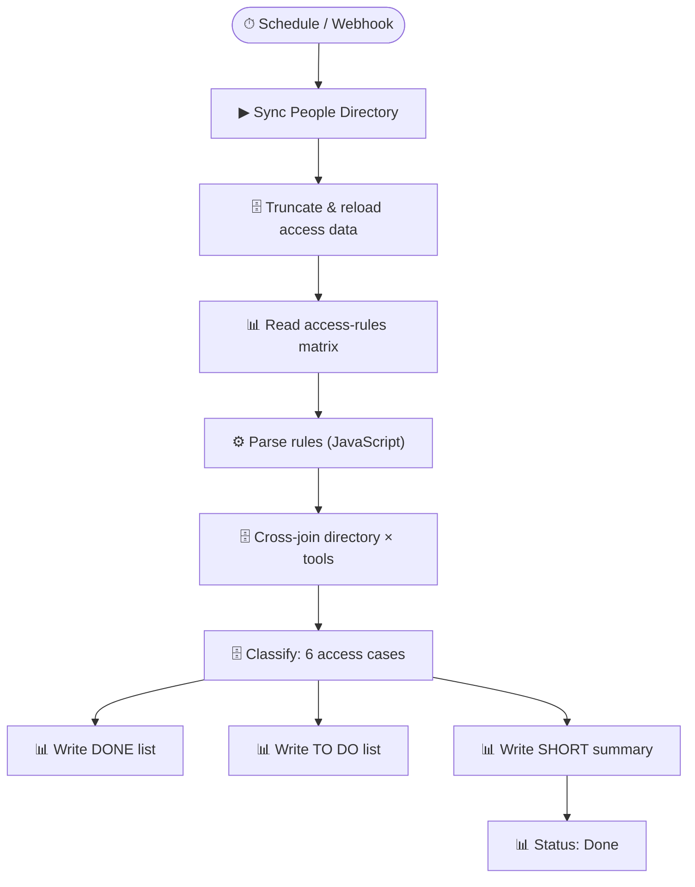

# Employee Access Management

> Automates access provisioning and revocation by cross-referencing an employee directory with an access-rules matrix — produces a daily grant/revoke action list.

**Built with:** n8n, Google Sheets, PostgreSQL, JavaScript, Webhooks, Scheduled trigger, Sub-workflows, Loop/batch processing, Complex SQL (CTEs, range_agg, CROSS JOIN LATERAL)
**Workflow size:** 38 nodes
**Source:** [`workflow.json`](./workflow.json) — the actual n8n workflow (sanitized; see note below)

## Problem
IT/Ops teams manually tracked which employees should have access to which internal tools. Every new hire, departure, or role change meant someone cross-checking a spreadsheet and creating tickets — access gaps and stale accounts were inevitable.

## Solution
A scheduled n8n workflow that reads the live employee directory, compares it against a rules matrix, and produces ready-to-act grant/revoke lists with zero manual lookup.

## How it works
1. Triggers on schedule (or via webhook for ad-hoc runs); first syncs the People Directory to the data warehouse.
2. Reads the current access-rules matrix from Google Sheets and parses it with a JavaScript Code node (mapping employee types to Yes/No access flags).
3. Loads existing access data from PostgreSQL and cross-joins it with the current directory.
4. Runs six SQL-driven cases to classify every employee–tool pair: *New person (Grant)*, *No change*, *Add Grant*, *Grant/Revoke update*, *New Offboarded*, *Old Offboarded*.
5. Uses `range_agg` and `daterange` aggregation to merge overlapping access periods.
6. Outputs two separate sheets — **DONE** (completed actions) and **TO DO** (pending actions) — and updates a status tracker.

## Impact
Eliminated manual access audits and reduced the risk of stale accounts after offboarding from days to hours.

## Workflow diagram

---
*`workflow.json` is the real n8n export with its full node graph, expressions, SQL and
JavaScript logic intact. Credentials, endpoints, document IDs, personal data and the
employer's legal-entity details have been removed or replaced with placeholders. See
[SANITIZATION.md](../SANITIZATION.md).*
