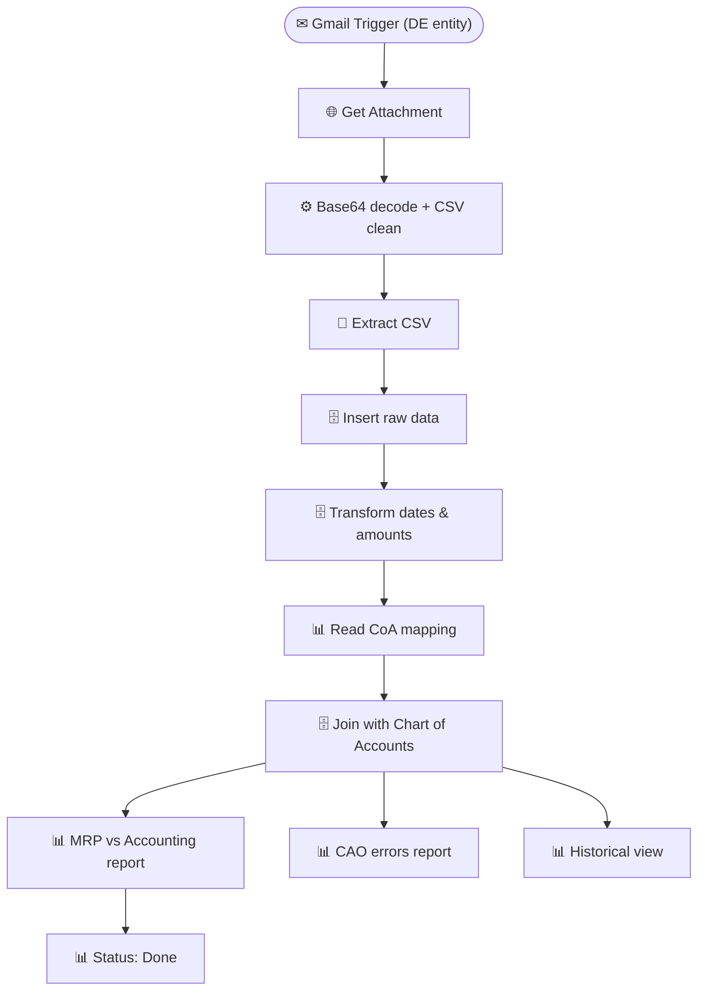

# Accounting ETL Pipeline (Email → DWH)

> Extracts accounting CSVs from email attachments, transforms and loads them into a PostgreSQL data warehouse, maps them to a Chart of Accounts, and publishes reconciled reports to Google Sheets.

**Built with:** n8n, Gmail API (REST), PostgreSQL, Google Sheets, JavaScript, Base64 decoding, CSV parsing, Complex SQL (date conversion, multi-table JOINs, Chart of Accounts mapping)
**Workflow size:** 55 nodes
**Source:** [`workflow.json`](./workflow.json) — the actual n8n workflow (sanitized; see note below)

## Problem
The accounting team for a German entity received monthly CSVs via email. Someone had to download the attachment, clean the data (fix date formats, parse currency amounts), load it into the warehouse, match every line item to the Chart of Accounts, and push the reconciled view to a shared sheet. Hours of repetitive work with a high error rate.

## Solution
An email-triggered n8n pipeline that runs end-to-end — from inbox attachment to reconciled Google Sheets report — the moment the accounting email lands.

## How it works
1. **Gmail trigger** fires on a new email matching a specific label/filter (German entity accounting).
2. Fetches the attachment via the Gmail REST API, decodes the base64 payload, and cleans CSV line breaks with a JavaScript Code node.
3. Parses the CSV and inserts raw rows into a PostgreSQL staging table.
4. Runs SQL transformations: converts Excel serial dates to proper dates, parses amount strings with currency symbols and European comma notation, and normalizes the schema.
5. Performs a multi-table JOIN against the Chart of Accounts (`account_hier`) to map each line item to its accounting category.
6. Outputs three reconciliation views to Google Sheets: the **MRP vs Accounting** comparison, **CAO error** report, and **historical** view — clearing and refreshing each sheet.
7. Updates a status tracker at every step for observability.

## Impact
Reduced a multi-hour manual ETL process to a fully automated pipeline that runs in under two minutes, with built-in error reporting.

## Workflow diagram

---
*`workflow.json` is the real n8n export with its full node graph, expressions, SQL and
JavaScript logic intact. Credentials, endpoints, document IDs, personal data and the
employer's legal-entity details have been removed or replaced with placeholders. See
[SANITIZATION.md](../SANITIZATION.md).*
