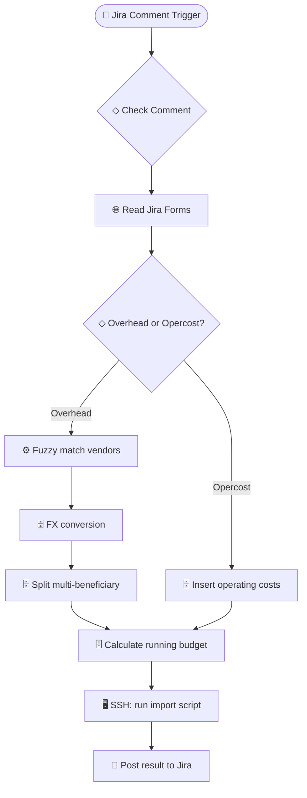

# Quarterly Budget Calculation

> Calculates quarterly project budgets from Jira form submissions — handles overhead, operating costs, FX conversion, fuzzy vendor matching, and remote script execution for data import.

**Built with:** n8n, Jira API (Forms API with X-ExperimentalApi header, comment triggers), PostgreSQL, JavaScript (Levenshtein distance), SSH, Complex SQL (FX conversion, string_to_array/unnest, running totals)
**Workflow size:** 42 nodes
**Source:** [`workflow.json`](./workflow.json) — the actual n8n workflow (sanitized; see note below)

## Problem
Finance teams calculated quarterly budgets manually: pulling data from Jira forms, looking up FX rates, splitting costs across beneficiaries, matching vendor names against a master list (despite inconsistent spelling), and computing running budget balances. The process was slow, error-prone, and blocked downstream reporting.

## Solution
A Jira comment-triggered n8n workflow that reads budget forms, classifies costs, converts currencies, matches vendors with fuzzy logic, and produces a calculated budget — all written back to the data warehouse and imported via a remote script.

## How it works
1. **Jira Trigger** fires when a specific comment is posted on a budget ticket.
2. Reads attached Jira Forms via the experimental Forms API (`X-ExperimentalApi: opt-in`) to extract budget line items.
3. Branches into **Overhead** vs **Operating Cost** paths with distinct processing logic.
4. Runs a JavaScript Code node with **Levenshtein distance** fuzzy matching to resolve vendor names against a master beneficiary list — handles typos and abbreviations.
5. Executes complex SQL: FX conversion using a rates table, `string_to_array` + `unnest` to split multi-beneficiary allocations, and running budget balance calculation.
6. Writes results to PostgreSQL and triggers a remote Python import script via **SSH** for downstream consumption.
7. Posts a Jira comment with the calculation result (success or error details).

## Impact
Cut quarterly budget calculation from a multi-day manual process to an automated pipeline triggered by a single Jira comment, with built-in FX conversion and fuzzy matching that eliminated vendor name mismatches.

## Workflow diagram

---
*`workflow.json` is the real n8n export with its full node graph, expressions, SQL and
JavaScript logic intact. Credentials, endpoints, document IDs, personal data and the
employer's legal-entity details have been removed or replaced with placeholders. See
[SANITIZATION.md](../SANITIZATION.md).*
