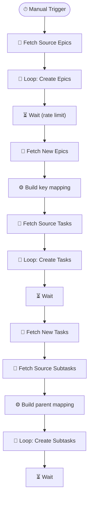

# Jira Cross-Project Migration

> Migrates Jira issues across projects while preserving the full Epic → Task → Subtask hierarchy, including parent-child relationships and key references.

**Built with:** n8n, Jira API (bulk issue operations), JavaScript, Loop/batch processing, Wait nodes (rate-limit handling)
**Workflow size:** 19 nodes
**Source:** [`workflow.json`](./workflow.json) — the actual n8n workflow (sanitized; see note below)

## Problem
When reorganizing Jira projects, teams needed to move hundreds of issues from one project to another while keeping the Epic→Task→Subtask hierarchy intact. Jira's built-in move feature doesn't preserve cross-project parent links, so doing this manually meant re-linking every issue — a tedious, error-prone process.

## Solution
A three-phase n8n workflow that copies issues in dependency order (Epics first, then Tasks, then Subtasks), re-links parent references at each level, and respects Jira's API rate limits.

## How it works
1. **Phase 1 — Copy Epics:** Fetches all Epics from the source project via JQL, creates them in the target project, and records the old-key → new-key mapping.
2. **Phase 2 — Copy Tasks:** Fetches Tasks from the source project, creates each in the target project with the correct Epic link (looked up from the Phase 1 mapping via a JavaScript Code node that matches `[oldKey]` patterns in the summary).
3. **Phase 3 — Copy Subtasks:** Fetches Subtasks, resolves their parent Task in the target project using the Phase 2 mapping, and creates them with the correct parent reference.
4. **Rate-limit handling:** Wait nodes (2–30 seconds) are inserted between batch operations to stay within Jira's API rate limits.

## Impact
Migrated hundreds of issues across projects in minutes instead of days, with all hierarchy links intact and zero manual re-linking.

## Workflow diagram

---
*`workflow.json` is the real n8n export with its full node graph, expressions, SQL and
JavaScript logic intact. Credentials, endpoints, document IDs, personal data and the
employer's legal-entity details have been removed or replaced with placeholders. See
[SANITIZATION.md](../SANITIZATION.md).*
