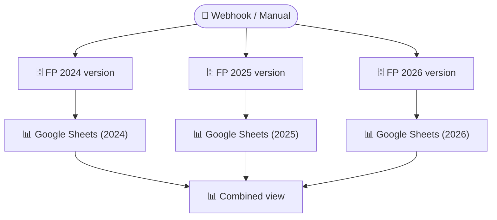

# Financial Plan Pipeline

> Extracts multi-year financial plan data from PostgreSQL, resolves the latest version for each year, and publishes consolidated outputs to Google Sheets for stakeholder review.

**Built with:** n8n, PostgreSQL, Google Sheets, Webhooks, Multi-year data handling, Version selection logic
**Workflow size:** 11 nodes
**Source:** [`workflow.json`](./workflow.json) — the actual n8n workflow (sanitized; see note below)

## Problem
Finance needed a consolidated view of the company's multi-year financial plan (2024–2026), but each year's data lived in its own schema with multiple versions. Manually identifying the latest version, pulling the data, and formatting it for stakeholders was a recurring time sink — especially around board meetings and quarterly reviews.

## Solution
A webhook-triggered n8n pipeline that queries each year's schema, picks the latest version automatically, and writes the consolidated plan to Google Sheets in a ready-to-present format.

## How it works
1. **Trigger** via webhook (or manual execution for testing).
2. Queries three PostgreSQL schemas (`finplan_24`, `finplan_25`, `finplan_26`) — one per fiscal year.
3. Resolves the latest data version in each schema using `MAX(CAST(TRIM(version)))` to handle mixed formatting.
4. Pulls the versioned financial plan data from each year.
5. Writes the consolidated output to separate Google Sheets tabs — one per year plus a combined view.

## Impact
Reduced financial plan consolidation from a manual multi-hour task to a single webhook call, ensuring stakeholders always see the latest approved version.

## Workflow diagram

---
*`workflow.json` is the real n8n export with its full node graph, expressions, SQL and
JavaScript logic intact. Credentials, endpoints, document IDs, personal data and the
employer's legal-entity details have been removed or replaced with placeholders. See
[SANITIZATION.md](../SANITIZATION.md).*
