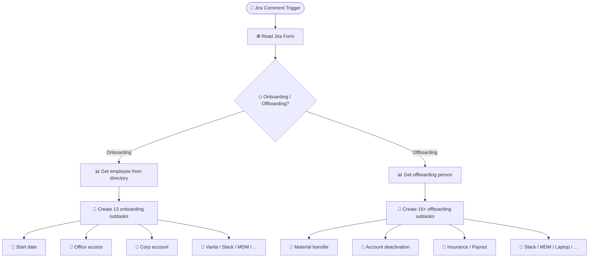

# Onboarding & Offboarding Automation

> Automatically creates 13+ onboarding or 16+ offboarding subtasks in Jira when an HR ticket is triggered, pulling employee details from a People Directory and assigning each task to the responsible team.

**Built with:** n8n, Jira API (comment trigger, subtask creation, Forms API), Google Sheets (People Directory, hardware DB), Conditional logic, Parallel task creation
**Workflow size:** 42 nodes
**Source:** [`workflow.json`](./workflow.json) — the actual n8n workflow (sanitized; see note below)

## Problem
Every new hire or departure required HR and IT to manually create dozens of Jira subtasks — office access, accounts, insurance, equipment, compliance checks, and more. Tasks were frequently missed, inconsistently named, and assigned to the wrong people, leading to onboarding delays and offboarding security gaps.

## Solution
A Jira comment-triggered workflow that reads the employee's details from a central directory and creates the full set of onboarding or offboarding subtasks in one shot, correctly assigned and pre-filled.

## How it works
1. **Jira Trigger** fires when a specific comment is posted on an HR ticket.
2. Reads the attached Jira Form via the Forms API to extract the employee name and action type.
3. **Branches** on Onboarding vs. Offboarding:

   **Onboarding (13 subtasks):** Start date, Office access, Medical insurance, Corporate account, Vanta compliance, Slack account, Team directory entry, Paperwork, Internal accounting, Background check, MDM enrollment, Notion access, Map/location setup.

   **Offboarding (16+ subtasks):** Material transfer, Final payout, Insurance termination, Office access revocation, Account deactivation, Account deletion, Vanta offboarding, Jira log review, Directory update, Paperwork, Internal accounting, Leave balance verification, Severance letter, Slack deactivation, Slack deletion, MDM offboarding, Laptop storage, Notion removal, Map update.

4. Looks up the employee in the **People Directory** (Google Sheets) to pull metadata for pre-filling subtask descriptions.
5. Cross-references a **hardware database** (Google Sheets) for equipment-related tasks.
6. Creates all subtasks as children of the parent HR ticket, with correct summaries and assignees.

## Impact
Standardized the entire onboarding/offboarding checklist — no missed tasks, consistent naming, correct assignments — and reduced setup time from 30+ minutes of manual ticket creation to a single comment trigger.

## Workflow diagram

---
*`workflow.json` is the real n8n export with its full node graph, expressions, SQL and
JavaScript logic intact. Credentials, endpoints, document IDs, personal data and the
employer's legal-entity details have been removed or replaced with placeholders. See
[SANITIZATION.md](../SANITIZATION.md).*
